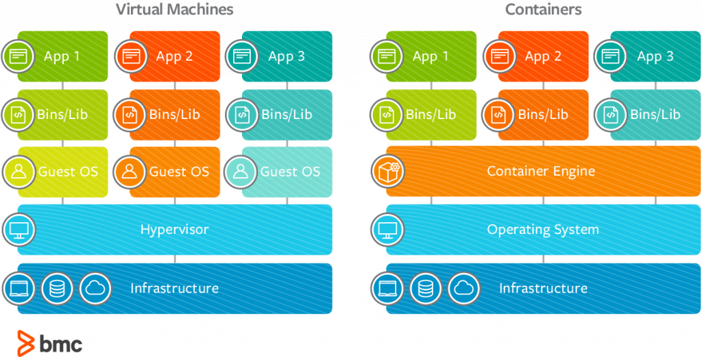

[[__TOC__]]

# Docker
Docker is a container technology: A tool for creating and managing containers.

## What is Docker
- LightWeight, open, secure platform
- Simplify building, shipping and running apps
- Shipping container for code
- Runs natively on Windows and Linux server
- Relies on Images and Containers

## Container
A standardized unit of software. A package of code and dependencies to run that code. 

ex: NodeJs code + NodeJs runtime

## Images
Templates or blueprints for containers. This contains code and required tools and runtime. We create multiple containers(running application) based on the image.

## Why do we need containers
- We want to have exact same versions in development and production. This ensures that it works as expected in all environment.
- It should be easy to share a common development environment. Setting a new system.
- We dont want to uninstall and re-install local dependencies all the time.

## Virtual Machine vs Container


## Docker Engine
Docker engine is the underlying technology that runs the containers.

## Docker Desktop
This includes Docker Daemon and CLI tool. The Daemon is a process that keeps on running that runs the Docker and is the heart of Docker.

## Image tag
A tag is a label applied to a Docker image in a repository. Tags are how various images in a repository are distinguished from each other.

## Commands to run an app
```js
-- base image or application runtime image.
-- will check if 'node' image exists else pulls from the image repository.(hub.docker.com)
FROM node

-- set the directory inside the container, default is 'root(.)'. We push our application within a folder 'app'. Created if not exists.
WORKDIR /app

-- Copies file from our current directory(directory our script is running in) to containers working directory.
COPY . /app

-- command to run the installation so as to install the dependecies. Run once for the image composition.
RUN npm install

-- port inside container our app is exposed.
EXPOSE 80

-- command to be run when the container is spawned from the image.
CMD [ "node", "server.js" ]
```

## Build image
```js
-- Move to the folder containing the _Dockerfile_
docker build .

-- with name and tag
docker build -t <name>:<tag> .
```

## Run container
```js
docker run -p 3000:3000 <image-id>

-- create container with name
docker run -p 3000:3000 --name <name> <image-id>

-- create container from the image name:tag combination
docker run -p 3000:3000 --name <name> <image-name>:<image-tag>
```

## Run container in detached mode
```js
docker run -p 3000:3000 -d <image-id>
```

## Run container and remove on stop
```js
docker run -p 3000:3000 -d --rm <image-id>
```

## Re-start an already created container
```js
docker start <container-name>
```

## Re-start an already created container in attached mode
```js
docker start -a <container-name>
```

## Re-start an already created container in attached and interactive mode
```js
docker start -a -i <container-name>
```

## Attach to a running container
```js
docker attach <container-name>
```

## Fetch logs of a running container
```js
docker logs <container-name>

-- read future logs
docker logs -f <container-name>
```

## Running container with interactive session
```js
docker run -it <container>

-- i: interactive mode
-- t: terminal
```

## Stop container
```js
-- get running processes
docker ps

-- stop container
docker stop <container-name>
```

## Get list of containers
```js
docker ps

-- get all container
docker ps -a
```

## Remove containers
```js
-- make sure the containers are not running
docker rm <container-name> <container-name> ...
```

## Copy file or folder into a running container
```js
-- for file
docker cp <file> <container-name>:<path-in-container>

-- for entire folder
docker cp <folder>/. <container-name>:<path-in-container>
```

## Get list of images
```js
docker images
```

## Inspect an images
```js
docker image inspect <image-id>
```

## Remove images
```js
-- make sure the images are not used in any containers
docker rmi <image-id> <image-id> ...
```

## Remove all images
```js
-- make sure the images are not used in any containers
docker images prune
```

## Create a clone of image
```js
docker tag <old-name>:<tag> <new-name>:<tag>
```

## Delete all images
```js
docker image prune -a
```

## DockerHub
Official Docker image registry. Contains public, private and official images.
[DockerHub.com](https://hub.docker.com/)

## Pushing local image to DockerHub
```js
-- requires you to login to DockerHub
docker login

-- push to your DockerHub repository
docker push <account-name>/<image-name>:<optional-tag>
```

## Pull images from repository
```js
docker pull <account-name>/<image-name>:<optional-tag>
```


